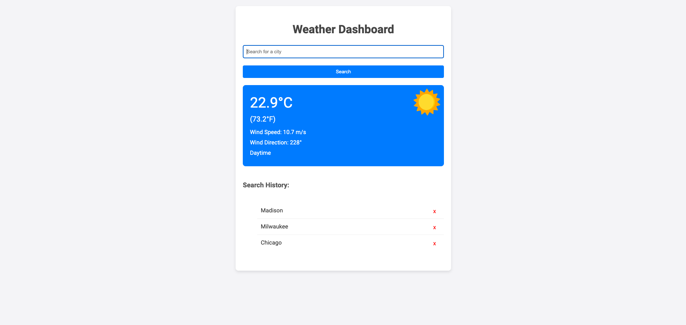

# 🌤️ Weather Dashboard

A simple and intuitive weather dashboard that provides current weather details for cities worldwide. Easily view search history and access weather data for previously searched cities.


## 🌟 Features

- **City Search**: Fetch weather data by entering a city name.
- **Search History**: Access recently searched cities with ease.
- **Day & Night Icons**: Dynamic icons based on the city's local time.
- **Temperature Conversion**: View temperature in both Celsius and Fahrenheit.
- **Responsive Design**: Optimized for desktop and mobile devices.

## 🛠 Technologies Used

- **React**: Powers the interactive UI.
- **Geocode API**: Fetches coordinates for any city.
- **WeatherAPI**: Retrieves weather details using coordinates.
- **CSS**: Styles the components for a sleek look.

## 🚀 Getting Started

### Clone the Repository

```bash
git clone https://github.com/yourusername/weather-dashboard.git
cd weather-dashboard
```

### Install Dependencies
Using npm:
```bash
npm install
```

or using yarn:
```bash
yarn
```

### Run the App
using npm:
```bash
npm start
```

or using yarn:
```bash
yarn start
```
The app should now be accessible at http://localhost:3000.

## 🤝 Contributing
Pull requests are welcome. For significant changes, please open an issue first to discuss your proposed changes.

## 📜 License
This project is licensed under the MIT License. Refer to the LICENSE file for more details.
